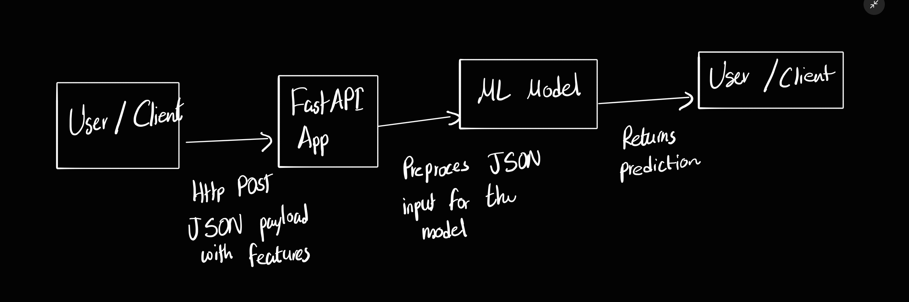

# Company Bankruptcy Prediction API

## Project Overview
This project provides a Machine Learning API to predict whether a company is at risk of bankruptcy. The API uses a Logistic Regression model trained on the [Company Bankruptcy Prediction dataset](https://www.kaggle.com/datasets/fedesoriano/company-bankruptcy-prediction).

The model predicts the probability of bankruptcy based on key financial indicators, making it useful for financial analysts, investors, and small firms assessing corporate risk.

---

## Target Users
- **Who:** Financial analysts, investors, risk management professionals
- **Expected Requests:** ~50–200 requests/day
- **Requirements:** Real-time JSON responses, low-latency (<1 second) predictions

---

## How It Works

### **API Interaction Diagram**



1. Client sends a JSON payload with company financial data.  
2. FastAPI validates the input with Pydantic.  
3. The trained Logistic Regression model predicts bankruptcy risk.  
4. API returns the prediction label (`Bankrupt` / `Not Bankrupt`) and the probability.

---

## Input Data (JSON)

The API expects the following **10 features**:

```json
{
  "Net_Value_Per_Share_B": 1.5,
  "Net_Value_Per_Share_C": 1.2,
  "Persistent_EPS_in_Last_Four_Seasons": 0.05,
  "Operating_Profit_Per_Share_Yuan_Yuan": 0.10,
  "Debt_ratio_percent": 40.0,
  "Net_Worth_to_Assets": 0.6,
  "Borrowing_dependency": 0.3,
  "Current_Liability_to_Assets": 0.25,
  "Current_Liabilities_Liability": 2000.0,
  "Liability_to_Equity": 1.0
}
```
---
## Instalation
### 1. Clone the Repository
```bash
git clone https://github.com/7strickes/spam_api.git
cd spam_api
```
```python
python3 -m venv .venv
source .venv/bin/activate  # Linux/macOS
.venv\Scripts\activate     # Windows
```
the API will now be accessible at: http://localhost:8000/docs
